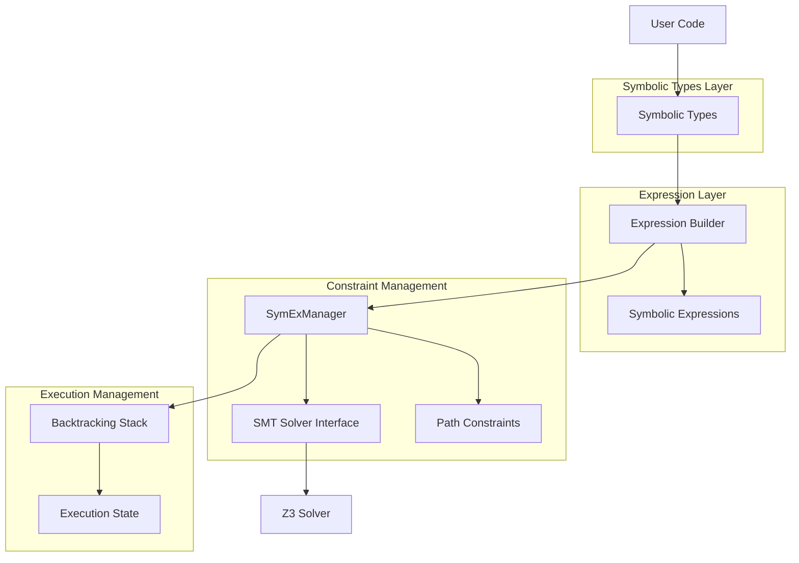

# Design Document

## Overview

The Symbolic Execution Engine for Rust leverages Rust's trait system to enable transparent symbolic execution alongside concrete execution. The system uses symbolic types that implement identical traits to their concrete counterparts, allowing existing Rust code to run symbolically without modification. During execution, symbolic expressions are built and path constraints are accumulated, enabling comprehensive program analysis through SMT solving.

The key innovation is runtime symbolic execution without static analysis - the Rust runtime executes code normally while symbolic types carry abstract representations of values and operations. This approach provides the benefits of symbolic execution while maintaining compatibility with existing Rust codebases.

## Architecture

The system consists of four main layers:

1. **Symbolic Types Layer**: Symbolic counterparts (SymU64, SymI32, etc.) that implement standard Rust traits
2. **Expression Layer**: Abstract syntax trees representing symbolic operations and values  
3. **Constraint Management Layer**: Path constraint accumulation and SMT solver interface
4. **Execution Management Layer**: Global context management and backtracking for path exploration



## Components and Interfaces

### Symbolic Types

Symbolic numeric types implement the same traits as their concrete counterparts:

- `SymU64`, `SymI32`, `SymU8`, etc. for integer types
- `SymF64`, `SymF32` for floating-point types  
- `SymBool` for boolean values

Each symbolic type contains:
- A unique symbolic variable identifier
- Reference to the global SymExManager
- Optional concrete value for concolic execution

Key traits implemented:
- Arithmetic operations (`Add`, `Sub`, `Mul`, `Div`, `Rem`)
- Bitwise operations (`BitAnd`, `BitOr`, `BitXor`, `Shl`, `Shr`)
- Comparison operations (`PartialEq`, `PartialOrd`, `Ord`)
- Conversion traits (`From`, `Into`, `TryFrom`, `TryInto`)
- Display and debugging traits (`Display`, `Debug`)

### Symbolic Expressions

Abstract syntax tree representation of symbolic operations:

```rust
pub enum SymExpr {
    Variable(String),           // Symbolic variable
    Constant(ConstValue),       // Concrete constant
    BinaryOp(BinOp, Box<SymExpr>, Box<SymExpr>),
    UnaryOp(UnOp, Box<SymExpr>),
    Conditional(Box<SymExpr>, Box<SymExpr>, Box<SymExpr>),
}

pub enum BinOp {
    Add, Sub, Mul, Div, Mod,
    BitAnd, BitOr, BitXor, Shl, Shr,
    Eq, Ne, Lt, Le, Gt, Ge,
}

pub enum ConstValue {
    U64(u64), I64(i64), F64(f64), Bool(bool),
}
```

Expressions support:
- Simplification and constant folding
- Serialization to SMT-LIB format
- Type checking and validation
- Hash-consing for memory efficiency

### SymExManager

Global context manager providing:

```rust
pub struct SymExManager {
    variable_counter: AtomicUsize,
    path_constraints: Vec<SymExpr>,
    solver: SmtSolver,
    backtrack_stack: Vec<ExecutionState>,
    variable_registry: HashMap<String, TypeInfo>,
}
```

Core responsibilities:
- Generate unique symbolic variable names
- Maintain current path constraints
- Interface with SMT solver for satisfiability queries
- Manage backtracking stack for path exploration
- Coordinate between symbolic types and solver

### SMT Solver Interface

Abstraction layer over Z3 SMT solver:

```rust
pub trait SmtSolver {
    fn check_sat(&mut self, constraints: &[SymExpr]) -> SatResult;
    fn get_model(&mut self) -> Option<Model>;
    fn push(&mut self);
    fn pop(&mut self);
    fn assert(&mut self, constraint: SymExpr);
}
```

The Z3 implementation handles:
- Translation from SymExpr to Z3 AST
- Constraint assertion and satisfiability checking
- Model extraction and conversion back to Rust values
- Solver state management (push/pop for backtracking)

## Data Models

### ExecutionState

Represents a point in symbolic execution for backtracking:

```rust
pub struct ExecutionState {
    pub path_constraints: Vec<SymExpr>,
    pub variable_bindings: HashMap<String, SymExpr>,
    pub solver_state_id: usize,
    pub branch_condition: Option<SymExpr>,
}
```

### Model

Concrete value assignment from SMT solver:

```rust
pub struct Model {
    pub assignments: HashMap<String, ConstValue>,
}
```

### TypeInfo

Metadata about symbolic variables:

```rust
pub struct TypeInfo {
    pub type_name: String,
    pub bit_width: Option<usize>,
    pub is_signed: bool,
    pub creation_site: Option<String>,
}
```

## Correctness Properties

*A property is a characteristic or behavior that should hold true across all valid executions of a system-essentially, a formal statement about what the system should do. Properties serve as the bridge between human-readable specifications and machine-verifiable correctness guarantees.*

After analyzing the acceptance criteria, several properties can be consolidated to eliminate redundancy:

**Property Reflection:**
- Properties 1.1 and 5.1 both test unique variable name generation - can be combined
- Properties 1.2 and 2.1 both test expression creation from operations - can be combined  
- Properties 3.1, 3.2, and 3.4 all test constraint management - can be combined into comprehensive constraint handling
- Properties 4.1 and 4.3 both test SMT solver communication - can be combined
- Properties 6.1 and 6.2 test complementary stack operations - can be combined into stack round-trip property

**Property 1: Unique variable generation**
*For any* sequence of symbolic variable creations, all generated variable names should be unique across the entire execution session
**Validates: Requirements 1.1, 5.1**

**Property 2: Expression construction from operations**  
*For any* arithmetic or bitwise operation performed on symbolic values, the resulting symbolic expression should correctly represent that operation in its abstract syntax tree
**Validates: Requirements 1.2, 2.1**

**Property 3: Concrete-symbolic conversion round-trip**
*For any* concrete value, converting it to symbolic and then extracting a concrete value from a satisfying model should preserve the original value
**Validates: Requirements 1.4**

**Property 4: Expression referential integrity**
*For any* symbolic variable used in multiple expressions, all references to that variable should maintain consistent identity and type information
**Validates: Requirements 1.5, 2.4**

**Property 5: Operation precedence preservation**
*For any* complex expression involving multiple operators, the abstract syntax tree should reflect correct mathematical precedence rules
**Validates: Requirements 2.2**

**Property 6: SMT serialization round-trip**
*For any* symbolic expression, serializing to SMT-LIB format and parsing by the solver should produce equivalent satisfiability results
**Validates: Requirements 2.5**

**Property 7: Constraint accumulation and consistency**
*For any* sequence of boolean comparisons and branch conditions, the accumulated path constraints should be logically consistent and properly conjoined
**Validates: Requirements 3.1, 3.2, 3.4**

**Property 8: Satisfiability query correctness**
*For any* set of path constraints, querying satisfiability should return correct results and generate valid models when satisfiable
**Validates: Requirements 3.5, 4.1, 4.2**

**Property 9: SMT translation correctness**
*For any* symbolic expression, translation to solver format should produce valid SMT-LIB that represents the same mathematical relationship
**Validates: Requirements 4.3, 4.4**

**Property 10: Execution state round-trip**
*For any* execution state, saving to the backtracking stack and then restoring should preserve all symbolic variables, constraints, and solver state
**Validates: Requirements 6.1, 6.2**

**Property 11: Path exploration completeness**
*For any* program with finite branching, symbolic execution should explore all feasible paths without infinite loops or missing branches
**Validates: Requirements 6.3, 6.5**

**Property 12: Trait behavioral compatibility**
*For any* operation available on concrete types, the corresponding operation on symbolic types should maintain the same interface contract and behavioral semantics
**Validates: Requirements 7.1, 7.3**

**Property 13: Generic trait bound satisfaction**
*For any* generic function with trait bounds satisfied by concrete types, symbolic types should satisfy the same bounds and work correctly in generic contexts
**Validates: Requirements 7.2, 7.4**

## Error Handling

The system implements comprehensive error handling across all layers:

### Symbolic Type Errors
- **InvalidOperation**: Operations not supported for the symbolic type
- **TypeMismatch**: Incompatible types in operations
- **OverflowError**: Arithmetic overflow in symbolic operations

### Expression Errors  
- **MalformedExpression**: Invalid expression structure
- **UnboundVariable**: Reference to undefined symbolic variable
- **CircularReference**: Circular dependencies in expressions

### SMT Solver Errors
- **SolverTimeout**: Solver exceeded time limit
- **SolverError**: Internal solver error or invalid input
- **ModelExtractionError**: Failed to extract concrete values from model

### Manager Errors
- **StateCorruption**: Inconsistent internal state detected
- **StackUnderflow**: Attempted to pop from empty backtracking stack
- **ResourceExhaustion**: Out of memory or other resources

Error recovery strategies:
- Graceful degradation to concrete execution when symbolic execution fails
- Automatic constraint simplification for solver timeouts
- State validation and recovery for corruption detection
- Resource monitoring and cleanup for memory management

## Testing Strategy

The system employs a dual testing approach combining unit tests and property-based tests:

### Unit Testing Approach
Unit tests verify specific examples, edge cases, and integration points:
- Concrete examples of symbolic operations and their expected results
- Edge cases like overflow conditions, empty constraints, and boundary values  
- Integration between components (SymExManager ↔ SMT Solver)
- Error condition handling and recovery mechanisms

### Property-Based Testing Approach  
Property-based tests verify universal properties across all inputs using **QuickCheck for Rust** (`quickcheck` crate):

**Configuration Requirements:**
- Each property-based test MUST run a minimum of 100 iterations
- Each test MUST be tagged with a comment referencing the design document property
- Tag format: `// **Feature: symbolic-execution-engine, Property {number}: {property_text}**`
- Each correctness property MUST be implemented by a SINGLE property-based test

**Generator Strategy:**
- Smart generators that constrain inputs to valid symbolic execution scenarios
- Generators for symbolic expressions, constraint sets, and execution states
- Compositional generators that build complex scenarios from simple components

**Property Test Coverage:**
- Variable uniqueness across large numbers of creations
- Expression correctness for randomly generated operation sequences  
- Round-trip properties for serialization and state management
- Constraint consistency across random constraint combinations
- SMT solver integration with randomly generated satisfiable/unsatisfiable problems

The combination ensures comprehensive coverage: unit tests catch concrete bugs and regressions, while property tests verify correctness across the infinite input space of symbolic execution scenarios.