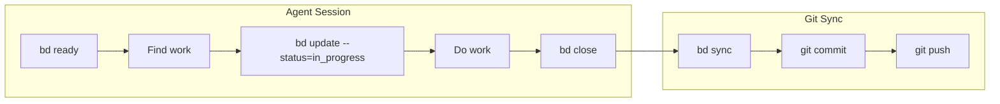
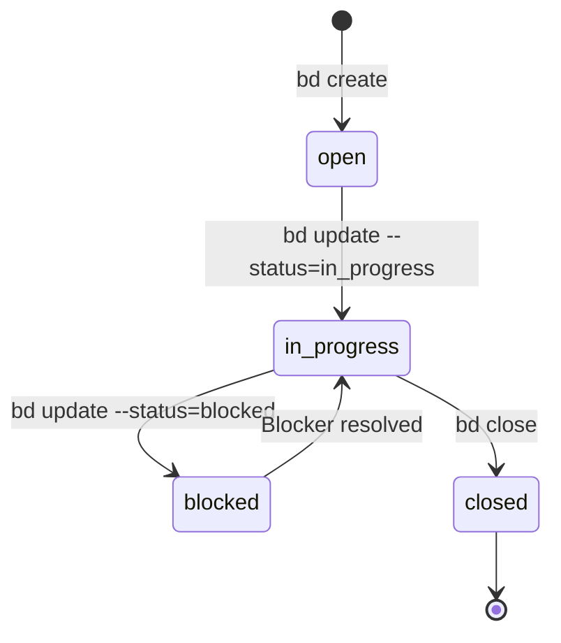

# Beads for Task Tracking


## Context

AI agents (Claude Code, Cursor, etc.) working in the repo need a way to track tasks, issues, and work items. The tracking system must:

1. **Persist across sessions** - Agents start fresh each session; work state must survive
2. **Live in the repository** - No external dependencies or API keys required
3. **Support collaboration** - Multiple agents and humans can work on the same codebase
4. **Integrate with git** - Changes sync automatically with commits/pushes
5. **Be agent-friendly** - CLI-first, structured data, no GUI required

### The Problem with Alternatives

| Tool | Why It Fails for AI Agents |
|------|---------------------------|
| **GitHub Issues** | Requires API tokens, network access, rate limits, not in repo |
| **Markdown TODOs** | Unstructured, no state machine, conflicts on merge |
| **TodoWrite tool** | Session-scoped only, lost when agent exits |
| **JIRA/Linear** | External service, requires auth, overkill for local work |
| **Plain text files** | No schema, no queries, merge conflicts |

## Decision

Use **Beads** (`bd`) for all task tracking within the monorepo.

### What is Beads?

Beads is a git-native issue tracker that stores issues as structured data in `.beads/` directory. Issues are exported to JSONL format and committed to git, making them part of the repository history.

```
.beads/
├── beads.db          # SQLite database (local working copy)
├── issues.jsonl      # Portable export (committed to git)
└── daemon.lock       # Sync daemon state
```

### Core Workflow



### Essential Commands

| Command | Purpose |
|---------|---------|
| `bd prime` | Load context at session start |
| `bd ready` | Find issues with no blockers |
| `bd create --title="..." --type=task` | Create new issue |
| `bd update <id> --status=in_progress` | Claim work |
| `bd close <id>` | Mark complete |
| `bd sync` | Sync with git |

### Issue States



## Consequences

### Positive

- **Zero external dependencies** - Works offline, no API keys
- **Git-native** - Issues travel with code, sync on push/pull
- **Agent-friendly** - CLI-first, structured queries, machine-readable
- **Multi-agent safe** - Git merge driver handles conflicts
- **Auditable** - Full history in git log

### Negative

| Trade-off | Impact | Mitigation |
|-----------|--------|------------|
| **Learning curve** | New CLI to learn | Simple commands, good docs |
| **No web UI** | Can't browse issues in browser | Use `bd list`, `bd show` |
| **Repo bloat** | `.beads/` adds to repo size | Compact old issues with `bd compact` |

### Constraints

- **MUST** run `bd prime` at start of each agent session
- **MUST** run `bd sync` before ending session
- **MUST NOT** use TodoWrite tool for persistent task tracking
- **MUST NOT** create markdown TODO files for issue tracking
- **SHOULD** use `bd ready` to find available work
- **SHOULD** close issues immediately when complete (don't batch)

## Session Protocol

Every agent session MUST follow this protocol:

### Session Start
```bash
bd prime              # Load context
bd ready              # Find available work
```

### Session End
```bash
bd sync               # Export changes
git add .beads/       # Stage beads changes
git commit            # Commit with code
git push              # Push to remote
```

## Alternatives Considered

### GitHub Issues

**Rejected because:**
- Requires network access and API tokens
- Rate limited
- Not in repository
- Agents need GitHub auth configuration

### Markdown TODO Files

**Rejected because:**
- No state machine (open → in_progress → closed)
- Unstructured - hard to query
- Merge conflicts on concurrent edits
- No dependency tracking

### Linear/JIRA/Notion

**Rejected because:**
- External service requiring auth
- Overkill for local development work
- Network dependency
- Cost

### TodoWrite Tool (Claude Code built-in)

**Rejected because:**
- Session-scoped only - lost when agent exits
- Not persisted to repository
- No git integration
- Can't be shared across agents

## References

- [Beads Repository](https://github.com/beads-project/beads)